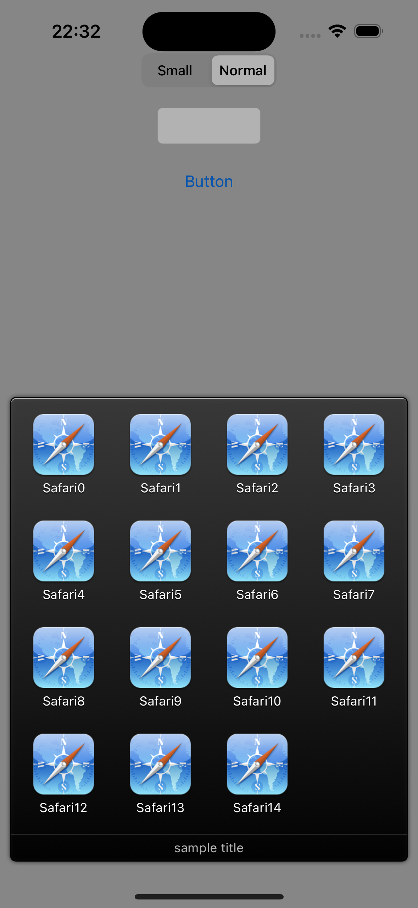

## AAActivityAction [](https://travis-ci.org/r-plus/AAActivityAction)

AAActivityAction is Reeder 3 like ActionSheet. Method architecture is inspired by `UIActivity` and `UIActivityViewController`.

AAActivityAction | Reeder 3
--- | ---
 | 

### Installation

#### CocoaPods
Add `pod 'AAActivityAction'` to your Podfile.

#### Manually

1. Link `QuartzCore` framework.
1. Drag the `AAActivityAction` folder to your project.

### Requirement

* iOS 11 or higher.
* `QuartzCore` framework.
* ARC.

### Usage

````
AAActivity *activity = [[AAActivity alloc] initWithTitle:@"Safari"
                                                   image:[UIImage imageNamed:@"Safari.png"]
                                             actionBlock:^(AAActivity *activity, NSArray *activityItems) {
    // do something...
}];
AAActivityAction *activityAction = [[AAActivityAction alloc] initWithActivityItems:@[@"http://www.apple.com/"]
                                                             applicationActivities:@[activity]
                                                                         imageSize:AAImageSizeSmall];
activityAction.title = @"sample title";
activityAction.directActionEnabled = YES; // If available only one activity, directly invoke its activity action. default is NO.
[activityAction show];
// or showInView
// [activityAction showInView:view];
````

### License
MIT License.
